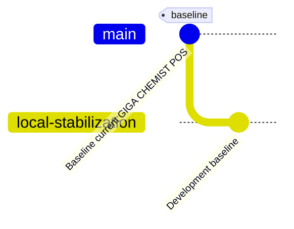

# GIGA CHEMIST — GitHub Baseline Documentation

**Repository:** https://github.com/Aimtech7/giga_chemist-hybrid.git  
**Baseline Branch:** `main`  
**Development Branch:** `local-stabilization`  
**Baseline Date:** 2026-10-04  
**Project Root:** `H:\GIGA-CHEMIST-POS`  

---

## 1. Executive Summary

This document captures the initial clean source baseline for the GIGA CHEMIST Point of Sale (POS) and Inventory Management System. The workspace was audited, sanitized of sensitive secrets, pruned of excessively large database dumps and runtime artifacts, and established as the foundation on GitHub.

---

## 2. Project & Environment Details

- **Workspace Path:** `H:\GIGA-CHEMIST-POS`
- **Application Stack:** React, TypeScript, Vite, Tailwind CSS, Dexie.js (IndexedDB), Express/Node.js, PostgreSQL, Supabase Cloud integration.
- **Git State Prior to Baseline:** Git was initialized with historical local commits and remote tracking configured to `https://github.com/Aimtech7/giga_chemist-hybrid.git`.

---

## 3. Secret Audit & Sanitization

| Item | Status | Details |
|------|--------|---------|
| `.env` | **Ignored** | Real environment file containing local credentials excluded via `.gitignore`. |
| `.env.example` | **Sanitized** | Sanitized with generic placeholder values (`YOUR_POSTGRES_PASSWORD`, `YOUR_JWT_SECRET_KEY`, `YOUR_SUPABASE_SERVICE_ROLE_KEY`). |
| Source Code Secrets | **Clean** | Codebase audited; no hardcoded API keys, JWT secrets, or production passwords found in application source. |

---

## 4. Excluded & Retained Local Artifacts

The following files and directories are explicitly ignored by `.gitignore` and retained safely on local disk:

1. **`deployment/postgresql/giga_chemist_full.sql`** (~254 MB) — Full PostgreSQL database dump retained locally for migration reference and local disaster recovery. Excluded from Git to respect GitHub file size recommendations without Git LFS overhead.
2. **`chemist_pos.sql`** (~41 MB) — Legacy POS SQL dump retained locally.
3. **`node_modules/`** — Standard package dependencies.
4. **`dist/` / `build/`** — Production build outputs.
5. **`logs/` / `*.log`** — Runtime and startup logs.
6. **`backups/` / `data/backups/` / `*.dump` / `pos.zip`** — Local database backup files and archive snapshots.

---

## 5. Version Control Topology

- **`main`**: Production baseline branch matching the verified project snapshot.
- **`local-stabilization`**: Development branch branched off `main` for upcoming fixes and enhancements.

---

## 6. Baseline Verification Log

- **Git Status:** Clean working tree after staging and committing.
- **Baseline Commit SHA:** `dfdfa097df03e6f80dfb3e5fa869a31e56405a5c`
- **Remote Configuration:**
  - `origin`: `https://github.com/Aimtech7/giga_chemist-hybrid.git` (Push / Fetch)
- **Commit Message:** `"Baseline current GIGA CHEMIST POS"`

